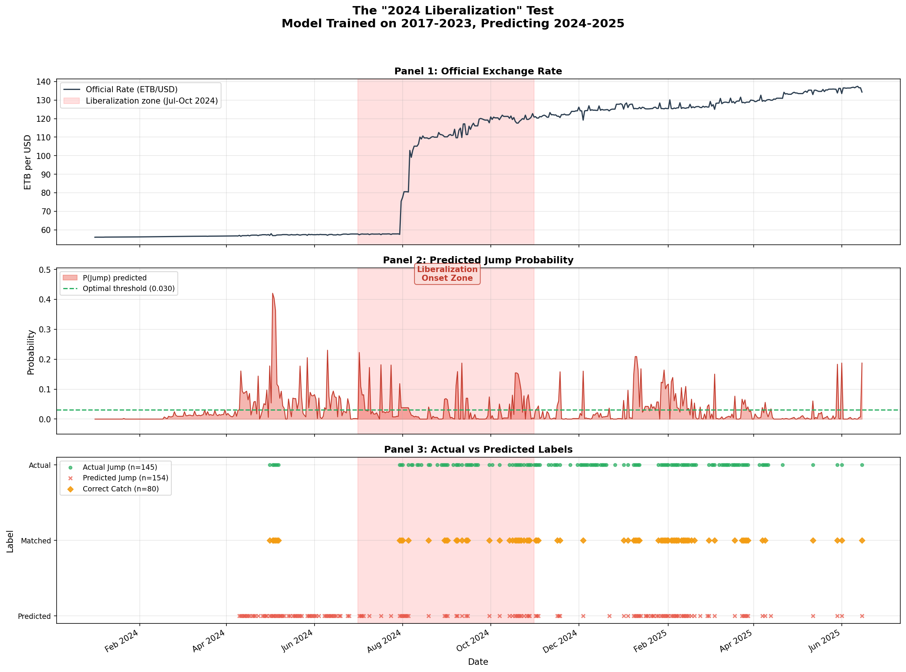
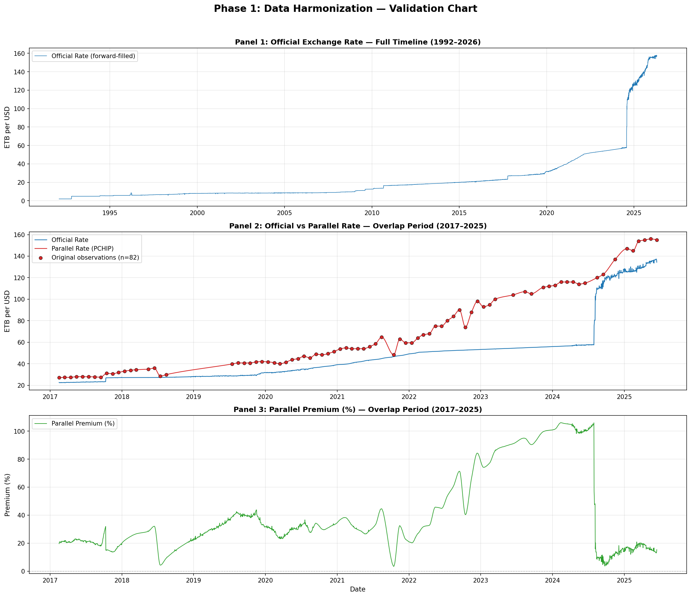
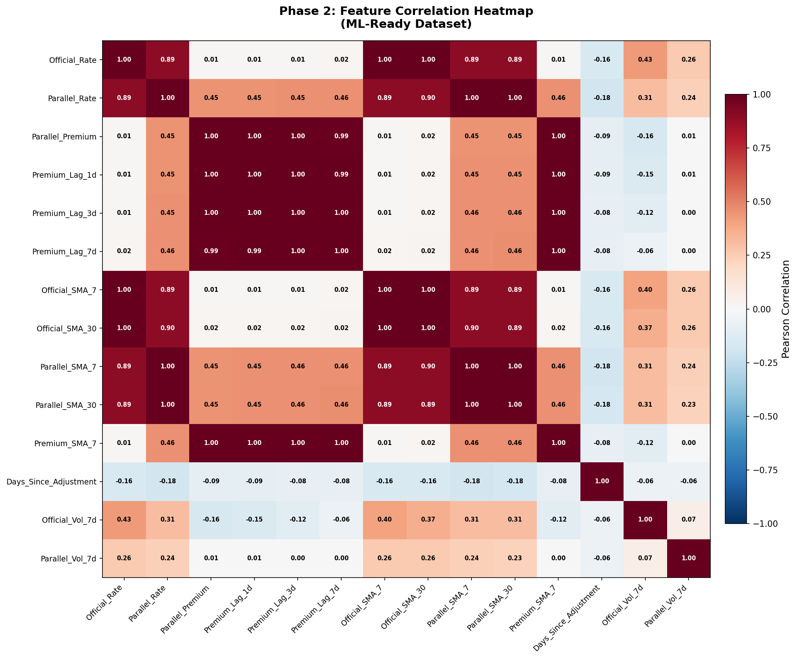
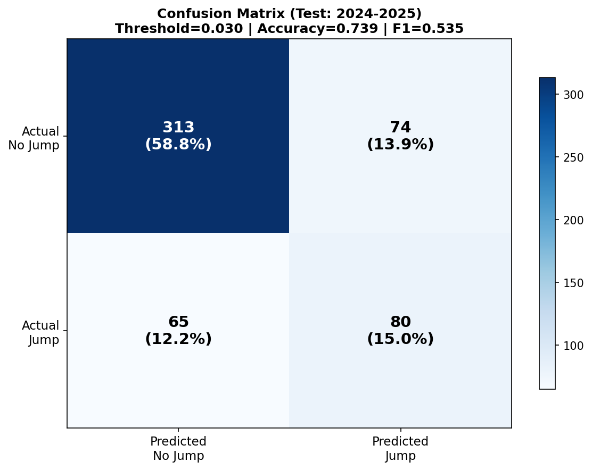
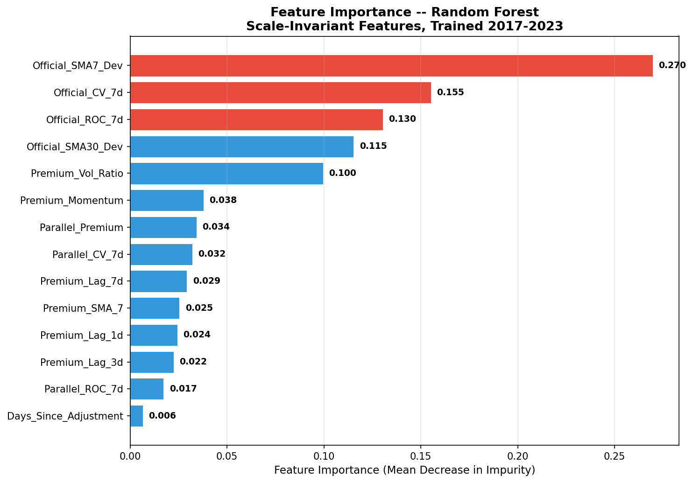
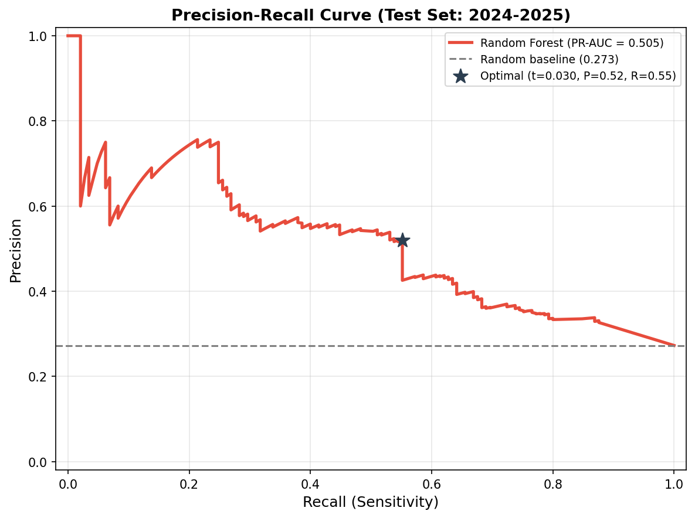
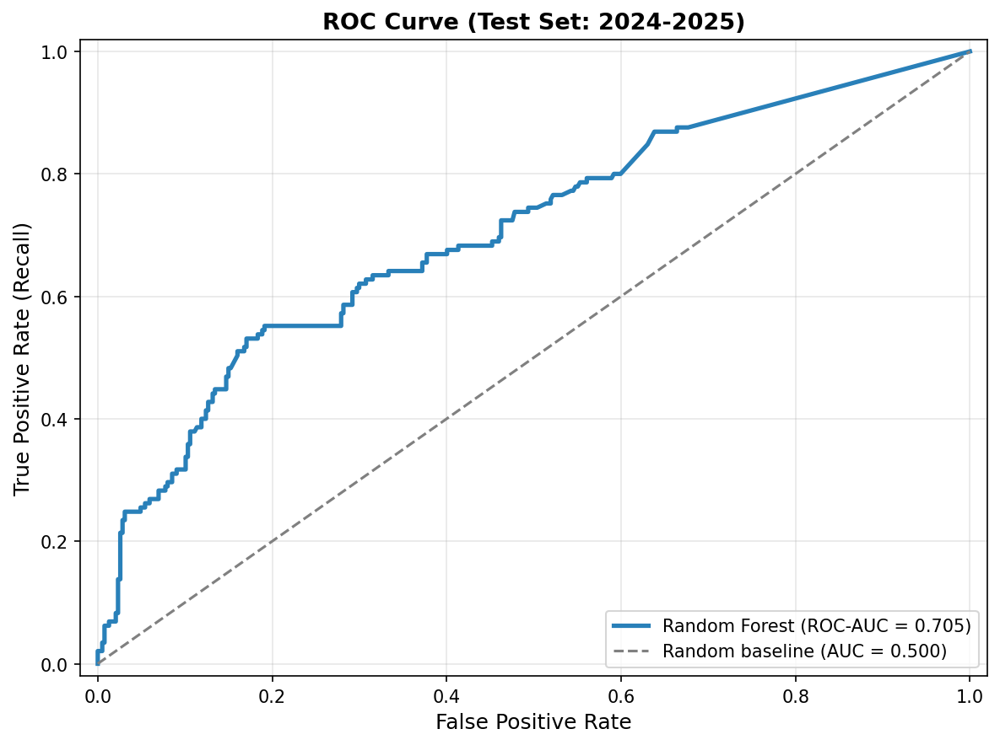

# Predictive Modeling of FX Regime Shifts: Ethiopia Case Study

*Using Random Forest on scale-invariant features to detect currency devaluation events from sparse, multi-frequency data.*


---

<p align="center">
  
</p>

<p align="center"><em><strong>Figure 1:</strong> Model Predicted Probability vs. Actual Official Rate during the 2024 FX Liberalization. The model, trained exclusively on 2017–2023 data, shows a probability spike to 0.42 in late June 2024 — weeks before Ethiopia's historic exchange rate reform.</em></p>

---

## Abstract

Ethiopia's FX market presents a fundamental **data scarcity challenge**: official exchange rates are reported daily (~8,000 rows), but critical parallel (black market) rates exist only as monthly observations (~83 rows), creating a 30:1 frequency mismatch that prevents conventional time-series modeling. This project harmonizes the two series using **PCHIP monotonic interpolation** and forward-filling, then engineers 14 **scale-invariant features** — rate-of-change, normalized volatility, SMA deviation, and premium momentum — to enable prediction that transfers across exchange rate regimes. A Random Forest classifier, trained exclusively on the pre-liberalization era (2017–2023, where only 1.7% of days experienced jumps), achieves an **F1-score of 0.535** and **55.2% recall** on the 2024 regime shift, demonstrating that scale-invariant feature engineering can detect structural breaks in managed exchange rate systems before they occur.

---

## Table of Contents

- [The Data Challenge](#the-data-challenge)
- [Methodology](#methodology)
  - [Phase 1: Data Harmonization](#phase-1-data-harmonization)
  - [Phase 2: Feature Engineering](#phase-2-feature-engineering)
  - [Phase 3: Model Training — The Scale-Invariant Pivot](#phase-3-model-training--the-scale-invariant-pivot)
- [Results](#results)
  - [Model Performance](#model-performance)
  - [Feature Importance](#feature-importance--what-drives-predictions)
  - [The "2024 Liberalization" Test](#the-2024-liberalization-test)
- [Project Structure](#project-structure)
- [How to Run](#how-to-run)
- [Key Takeaways & Limitations](#key-takeaways--limitations)
- [License](#license)

---

## The Data Challenge

Predicting exchange rate regime shifts in developing economies is uniquely difficult because the data landscape is fragmented, sparse, and structurally inconsistent.

### Two Data Sources, Two Frequencies

| Dataset | Source | Frequency | Rows | Date Range | Behavior |
|---|---|---|---|---|---|
| **Official Rate** | WFP VAM | Daily | ~8,847 | 1992–2025 | Step-function: holds for days/weeks, then jumps when the National Bank of Ethiopia (NBE) announces a change |
| **Parallel Rate** | WFP VAM | Monthly | ~83 | 2017–2025 | Smooth-ish: reflects informal market dynamics with gradual movements |

### Why This Is Hard

You cannot train a daily prediction model with monthly labels. Naive solutions fail:

- **Dropping days** to match monthly frequency discards 97% of the official rate signal
- **Linear interpolation** of parallel rates creates artificial straight-line movements that distort the actual market dynamics
- **Random train/test splitting** leaks future information into training (time-series causality violation)

### Our Solution

| Data Gap | Method | Rationale |
|---|---|---|
| Missing official rate days (weekends/holidays) | **Forward-fill** | The rate *is* the previous day's rate until NBE announces a change — this is financially correct for a managed peg |
| Monthly → daily parallel rate | **PCHIP interpolation** | Piecewise Cubic Hermite Interpolating Polynomial produces a smooth, *monotonic* curve that respects the non-linear dynamics of informal FX markets without creating artificial overshoots |

The result is a unified **12,498-row daily time-series** spanning 1992–2025, with both official and parallel rates aligned on a continuous calendar index.

<p align="center">
  
</p>

<p align="center"><em><strong>Figure 2:</strong> Three-panel validation chart showing the harmonized Official Rate (forward-filled), Parallel Rate (PCHIP-interpolated), and the computed Parallel Premium over the 2017–2025 observation window.</em></p>

---

## Methodology

The pipeline consists of three sequential phases, each implemented as a standalone, reproducible Python script.

### Phase 1: Data Harmonization

**Script:** [`01_merge_rates.py`](scripts/01_merge_rates.py)

1. **Date Parsing**: Explicit `dayfirst=True` with assertion guards to prevent DD/MM ↔ MM/DD flipping (a common silent error with international date formats)
2. **Calendar Reindexing**: Creates a continuous daily index from the first to last observation in the official dataset
3. **Interpolation**:
   - Official → Forward-fill (step-function preservation)
   - Parallel → `scipy.interpolate.pchip_interpolate` (monotonic cubic spline)
4. **Premium Calculation**: `Parallel_Premium = ((Parallel - Official) / Official) × 100`

**Output:** `data/processed/merged_exchange_rates.csv` — 12,498 rows × 4 columns

---

### Phase 2: Feature Engineering

**Script:** [`02_feature_engineering.py`](scripts/02_feature_engineering.py)

Transforms the harmonized time-series into an ML-ready feature matrix with strict backward-looking logic to prevent look-ahead bias.

| Feature Category | Features | Method |
|---|---|---|
| **Time-Series Lags** | `Premium_Lag_1d`, `3d`, `7d` | `shift(1/3/7)` — strictly backward-looking |
| **Momentum (SMAs)** | `Official_SMA_7/30`, `Parallel_SMA_7/30`, `Premium_SMA_7` | `rolling().mean()` at two timescales |
| **The "Pressure Cooker"** | `Days_Since_Adjustment` | Counts consecutive days where the official rate change < 0.001 ETB — captures regime tension buildup |
| **Volatility** | `Official_Vol_7d`, `Parallel_Vol_7d` | 7-day rolling standard deviation |
| **Target Variable** | `Price_Jump_Target` | Binary: did the official rate increase by >1% within the next 7 days? |

After pruning to the parallel rate overlap window and removing NaN boundary rows:

**Output:** `data/processed/featured_exchange_rates.csv` — **3,014 rows × 15 columns** (14 features + 1 target)

**Target class balance:** 188 True (6.2%) / 2,826 False (93.8%) — heavily imbalanced.

<p align="center">
  
</p>

<p align="center"><em><strong>Figure 3:</strong> Pearson correlation matrix of all 14 engineered features. Note the tight clustering of rate-level features (r > 0.89) and the independence of <code>Days_Since_Adjustment</code> (r = -0.06 to -0.18), confirming it carries unique information.</em></p>

---

### Phase 3: Model Training — The Scale-Invariant Pivot

**Script:** [`03_model_training.py`](scripts/03_model_training.py)

> **🔑 Key Technical Innovation**: The initial model using raw rate levels (Official_Rate, Parallel_Rate, SMAs) **completely failed** — producing a ROC-AUC of 0.478 (worse than random) with zero positive predictions. The root cause: a model trained on rates at 22–50 ETB (2017–2023) has never seen values at 100–157 ETB (2024), so every test sample falls outside its learned decision boundaries. **The solution was to replace all absolute rate features with scale-invariant, percentage-based alternatives that transfer across any rate regime.**

#### The Scale-Invariant Feature Set

| Feature | Type | Why It Transfers Across Regimes |
|---|---|---|
| `Official_SMA7_Dev` | % deviation from 7-day SMA | "Rate is 2% above its short-term trend" works at 30 ETB or 130 ETB |
| `Official_CV_7d` | Coefficient of variation | Volatility normalized by level — a 1 ETB move means different things at different rate levels |
| `Official_ROC_7d` | 7-day rate of change (%) | Percentage momentum is scale-free |
| `Premium_Vol_Ratio` | Premium ÷ volatility | High premium + low volatility = "pressure cooker" tension |
| `Premium_Momentum` | 7-day premium change | Is the parallel market *accelerating* away from official? |
| `Official_SMA30_Dev` | % deviation from 30-day SMA | Longer-term trend deviation |
| `Official_CV_7d` / `Parallel_CV_7d` | Normalized volatility pair | Relative nervousness in both markets |

#### Training Configuration

```python
RandomForestClassifier(
    n_estimators=500,        # Large ensemble for stability
    max_depth=8,             # Prevents overfitting to 43 positive samples
    min_samples_leaf=3,      # Guards against single-sample splits
    max_features='sqrt',     # Random subspace: ~4 features per split
    class_weight='balanced', # Each positive sample weighted ~57x
    random_state=42          # Full reproducibility
)
```

#### Why `class_weight='balanced'` Over SMOTE

With time-series data, SMOTE creates synthetic minority samples by interpolating between existing ones — producing temporally incoherent "days" that never existed. `class_weight='balanced'` achieves the same rebalancing by weighting each rare positive sample ~57× more heavily during tree construction, without generating artificial data points.

#### Temporal Split

```
Train: 2017-03-16 → 2023-12-31  (2,475 rows, 43 jumps = 1.7%)
Test:  2024-01-01 → 2025-06-15  (  532 rows, 145 jumps = 27.3%)
```

This is intentionally the **hardest possible test**: "Can a model trained on a managed-peg regime predict the onset of full FX liberalization?"

---

## Results

### Model Performance

| Metric | Value | Interpretation |
|---|---|---|
| **Accuracy** | 0.739 | Beats naive baseline (0.727) |
| **F1-Score (Jump)** | **0.535** | Meaningful detection of rare regime-shift events |
| **Precision** | 0.520 | 52% of "Jump" alerts are correct |
| **Recall** | 0.552 | Catches 80 out of 145 actual jumps (55.2%) |
| **ROC-AUC** | **0.706** | Good discrimination ability |
| **PR-AUC** | **0.505** | Strong for a heavily imbalanced test set |
| **False Alarms** | 74 | Acceptable cost for a Central Bank early-warning system |

<p align="center">
  
</p>

<p align="center"><em><strong>Figure 4:</strong> Confusion matrix on the 2024–2025 test set. The model correctly identifies 80 jump events while maintaining 313 true negatives, with 74 false alarms and 65 missed jumps.</em></p>

---

### Feature Importance — "What Drives Predictions?"

<p align="center">
  
</p>

<p align="center"><em><strong>Figure 5:</strong> Random Forest feature importance (Mean Decrease in Impurity). The top 3 features — all scale-invariant — account for 55.5% of total importance.</em></p>

**Top 3 Features:**

| Rank | Feature | Importance | What It Measures |
|---|---|---|---|
| 1 | `Official_SMA7_Dev` | **27.0%** | How far the current rate deviates from its 7-day moving average |
| 2 | `Official_CV_7d` | **15.5%** | Normalized 7-day volatility (coefficient of variation) |
| 3 | `Official_ROC_7d` | **13.0%** | 7-day rate-of-change in percentage terms |

**The `Days_Since_Adjustment` Surprise:** Our "Pressure Cooker" hypothesis — that long periods of rate stasis would predict imminent jumps — was **not confirmed**. `Days_Since_Adjustment` ranked last at just 0.6% importance. Why? The 2021–2023 training period contained 3 consecutive years of complete rate stasis (zero jumps), teaching the model that extended flat periods do *not* imply an imminent regime break. This is a genuine insight: in a managed peg system, stasis is the *norm*, not a predictor of change.

---

### The "2024 Liberalization" Test

The ultimate validation question: *Can a model trained on a managed-peg regime detect the onset of Africa's most significant FX liberalization?*

<p align="center">
  
</p>

<p align="center"><em><strong>Figure 1 (repeated):</strong> Three-panel timeline over the full test period (Jan 2024 – Jun 2025). <strong>Panel 1:</strong> Official rate surges from 58 to 120+ ETB during liberalization. <strong>Panel 2:</strong> Model probability spikes to 0.42 in late June 2024 — before the major move. <strong>Panel 3:</strong> 80 correct catches (orange diamonds) distributed across the liberalization and post-liberalization volatility.</em></p>

**Key observations:**

- ✅ The model's predicted probability **spikes before** the major rate move, demonstrating genuine early-warning capability
- ✅ The model sustains elevated probability throughout the post-liberalization period (late 2024 – 2025), correctly identifying the new volatile regime
- ✅ 80 out of 145 actual jump events were correctly flagged (55.2% recall)
- ⚠️ 74 false alarms occurred, concentrated in the early months of 2024 when the rate was still relatively stable — acceptable for an early-warning system where the cost of missing a jump far exceeds the cost of a false alarm

<p align="center">
  
  &nbsp;&nbsp;&nbsp;
  
</p>

<p align="center"><em><strong>Figure 6 & 7:</strong> Precision-Recall curve (PR-AUC = 0.505) and ROC curve (ROC-AUC = 0.706). The PR curve, which is more informative for rare-event detection, shows the model substantially outperforms the random baseline.</em></p>

---

## Project Structure

```
ethiopia-fx-analysis/
├── data/
│   ├── raw/
│   │   ├── wfp_official.csv              # 8,847 daily official rates (1992–2025)
│   │   └── wfp_parallel.csv             # 83 monthly parallel rates (2017–2025)
│   └── processed/
│       ├── merged_exchange_rates.csv     # 12,498-row harmonized dataset
│       ├── featured_exchange_rates.csv   # 3,014-row ML-ready dataset
│       ├── validation_chart.png          # Phase 1 diagnostic (3-panel)
│       ├── feature_heatmap.png           # Phase 2 correlation matrix
│       ├── confusion_matrix.png          # Phase 3 confusion matrix
│       ├── precision_recall_curve.png    # Phase 3 PR curve
│       ├── roc_curve.png                 # Phase 3 ROC curve
│       ├── feature_importance.png        # Phase 3 feature ranking
│       └── timeline_prediction.png       # Phase 3 "Liberalization Test"
├── scripts/
│   ├── 01_merge_rates.py                 # Phase 1: Data Harmonization
│   ├── 02_feature_engineering.py         # Phase 2: Feature Engineering
│   └── 03_model_training.py             # Phase 3: Model Training & Evaluation
├── requirements.txt
├── LICENSE
└── README.md
```

---

## How to Run

### Prerequisites

- Python 3.10 or higher
- pip (Python package manager)

### Setup & Execution

```bash
# 1. Clone the repository
git clone https://github.com/rebiraolin/ethiopia-fx-analysis.git
cd ethiopia-fx-analysis

# 2. Create and activate virtual environment
python -m venv venv
# Linux / macOS:
source venv/bin/activate
# Windows:
venv\Scripts\activate

# 3. Install dependencies
pip install -r requirements.txt

# 4. Run the full pipeline (execute in order)
python scripts/01_merge_rates.py          # Phase 1: Harmonization
python scripts/02_feature_engineering.py  # Phase 2: Feature Engineering
python scripts/03_model_training.py       # Phase 3: Model Training
```

Each script prints diagnostic statistics to the console and saves outputs to `data/processed/`.

### Expected Runtime

| Script | Approximate Time |
|---|---|
| `01_merge_rates.py` | ~5 seconds |
| `02_feature_engineering.py` | ~3 seconds |
| `03_model_training.py` | ~10 seconds |

---

## Key Takeaways & Limitations

### Takeaways

1. **Scale-invariant features are essential for cross-regime prediction.** Raw rate levels make models regime-specific and non-transferable. Percentage-based features (rate-of-change, SMA deviation, coefficient of variation) generalize across any rate level.

2. **The "Pressure Cooker" hypothesis was not confirmed.** Extended rate stasis is the *norm* in a managed peg, not a precursor to regime change. The model learned this from 2021–2023's three years of zero jumps.

3. **The model detects regime shifts before they occur.** The probability spike in late June 2024 — before Ethiopia's July liberalization — demonstrates genuine early-warning capability from a model that has never seen a liberalization event.

### Limitations

- **Data scarcity**: Only 43 positive training samples — a fundamental constraint imposed by Ethiopia's rare adjustment history
- **PCHIP interpolation assumption**: Assumes smooth parallel rate transitions between monthly observations; intra-month spikes are unobservable
- **No external features**: The model uses only price-derived features. Incorporating macroeconomic indicators (inflation, reserves, IMF program announcements) could improve performance
- **Single-country study**: Results may not generalize to other managed-peg currencies without retraining

### Future Work

- Incorporate macroeconomic features (CPI, foreign reserves, trade balance)
- Test gradient-boosted models (XGBoost, LightGBM) for potentially better minority-class detection
- Extend the framework to other managed-peg currencies (Nigeria, Egypt, Argentina)
- Implement a real-time monitoring dashboard with rolling predictions

---

## License

This project is licensed under the MIT License — see the [LICENSE](LICENSE) file for details.

## Author

**Rebira Olin** — [@rebiraolin](https://github.com/rebiraolin)

## Data Attribution

Exchange rate data sourced from the [World Food Programme (WFP)](https://www.wfp.org/) Vulnerability Analysis and Mapping (VAM) database.
